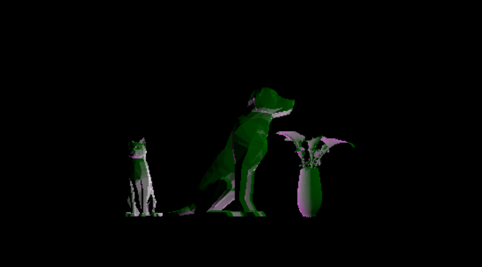
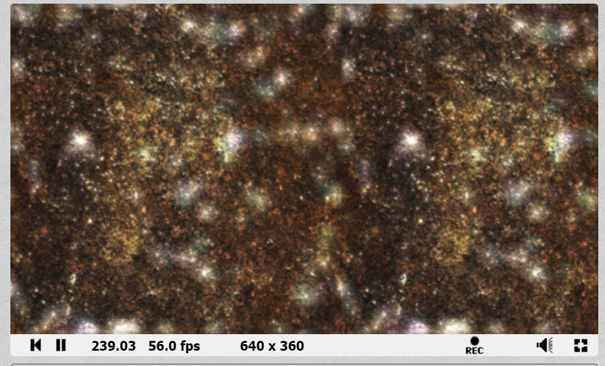
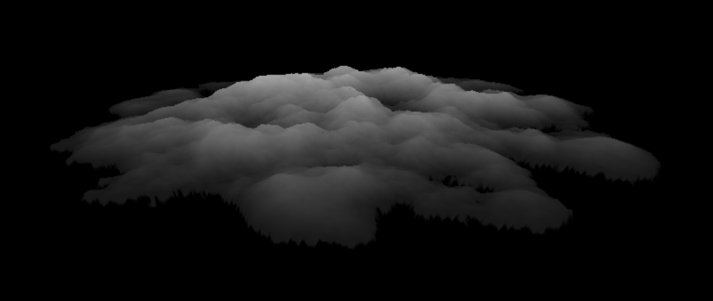
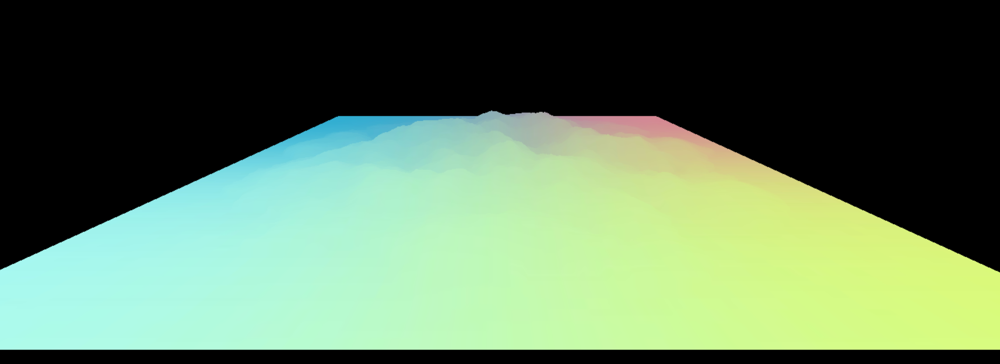
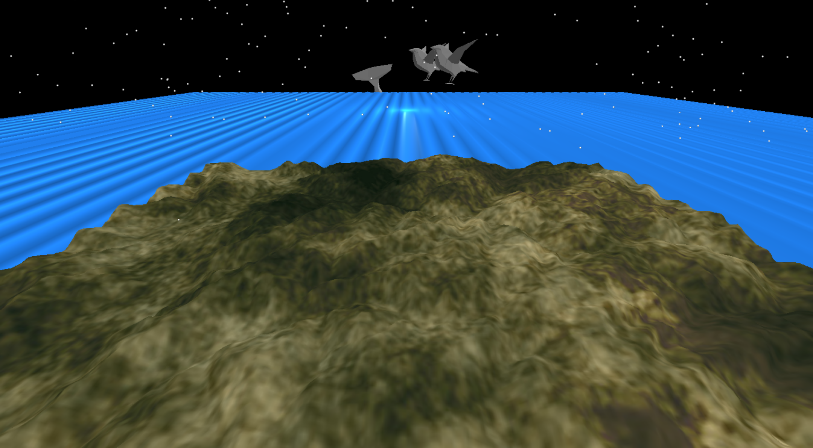
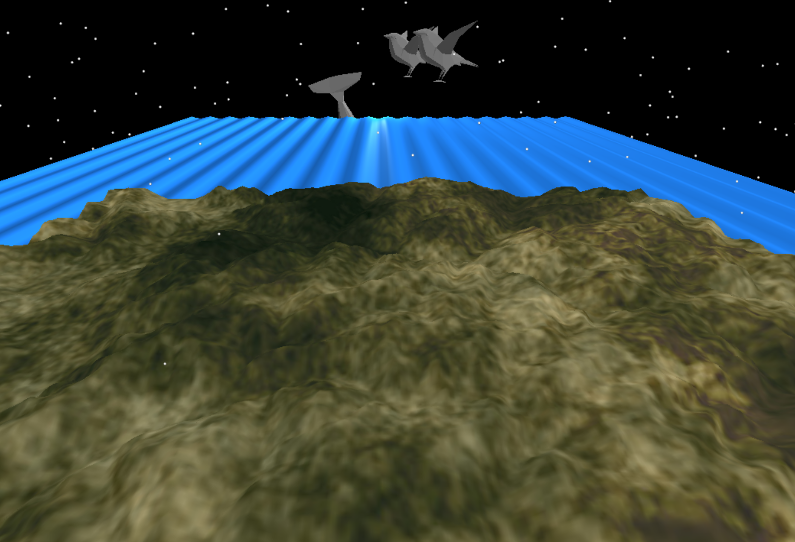
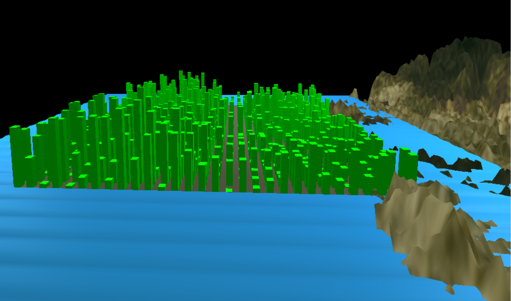

# CMPM163Labs
LAB 2

Video link: https://drive.google.com/file/d/1m5nucruO322vmzvCRUerzdWkt91hp_HF/view?usp=sharing 

Lab 3 
Video link: https://drive.google.com/file/d/14uFCJ4-ke_LY3TqY6q_JE7hgi7HuosXa/view?usp=sharing

A total of 5 cubes in video:
In row 1(left to right), the first cube is composed of red and golden yellow( color interpolated) with a my own sfragment shader; the second cube is Three.js phong material with 50% opacity and is composed of the colors lavender and pink highlight.
In row2, first cube is interpolated with red and blue using example code with shaders we made. Second cube, is made of phong material and is a grey cube with a green specular highlight. The third cube is color interpolated with aquamarine and perano( a type of purple) with the shaders we made.

LAB 4 README:
1) To get x value when given u value of uv coordinate, I realized you are essentially mutliplying the width of x of your texture map( which in this cas will be 8X8) and take that width and multiply with u value to get our x coordinate. So, our formula would be: u * width_of_x =x.
2) With same reasoning as 1, y will be focusing on height, and the formula will be y = height_of_y*v .
3) The color sampled from texture from uv coordinate of (0.375. 0.25) would be (3,2) in x,y coordinate which is white.

A total of 5 cubes were made:
The top cube was made with a texture which we needed to tile. I was able to scale down the texture but wasn't sure how to get it to repeat itself. Edit: I was able to get the tile to tile 3 by 3 on each face by scaling the uv by three and using mod function so that the tex value would always be between 0 and 1 and allow the tile to pick colors from texture in desired places. First cube on the bottom was made with three,js functionality using a brick texture. Next cube after that uses three.js to make brick cube with normal map.  The third cube mixes I mixed the pairs given in file to see what the texture would result with a different normal map. Last,cube makes a texture with shaders.
Part 1 Texture A (uses three.js built in texture functionality)
Part 1 Texture A & Normal Map A (uses three.js built in texture functionality)
Part 1 Texture B & Normal Map B (new texture/normal map combo using built in three.js functionality)
Part 2 Texture C (load this texture with shaders, as we worked through in the lab together)
Part 2 Texture D (tile this texture at least by showing a 2x2 grid) 

Lab4 videolink :https://drive.google.com/file/d/12h_6i8xceIQRlcB21m9LiDvrX4VoCLM0/view?usp=sharing (updated link)

Lab 5 README:

Lab5a video: https://drive.google.com/file/d/1s_p2ZYMvPvfKFAMlB9Li5nHFzGy3xzzs/view?usp=sharing

Lab5b video: https://drive.google.com/file/d/1t--6aAMwC1Ba-D22HDJ3qk6jXPJkfWhX/view?usp=sharing

Lab5c video: https://drive.google.com/file/d/13iSR-Othi9_QsRNO35oOxuxbWh1pXzfj/view?usp=sharing

In Lab5c, I tried to make a spiral but I couldn't get the shape. I tried to incorporate a spiral formula (as found on Stack Oerflow) to try to make a spiral galaxy using spiral equations, but it formed a more cicular blob of points.  I played around with points to create it to rotate spread out and rotate around a sphere object which will be our sun. I also added another sphere object to add as another planet since there was no free model for earth.

Lab 6 README:
Screenshot of Texture with corrected Aspect Ratio:

Link to shadertoy project w/circle and texture:
link: https://www.shadertoy.com/view/tdSfzh

Link to cool shadertoy proj:
https://www.shadertoy.com/view/MlS3Rh

Lab 7 README:

A screenshot of terrain with the height map as the texture:

A screenshot of terrain with a different texture as the texture:

Link to video of wavy blue plane: https://drive.google.com/file/d/1MOkBNXnR6qTiP0AMPkyJLX6XIJrad-xv/view?usp=sharing

A screenshot mountain + water scene:

Partner Process of their lab and answer to Questions on Lab:

i. part 1

ii. the most challenging part was understanding the layout/format for the vertex shaders

iii. the most interesting part was seeing how objects could be made into different shapes using only the shader

iv. we didn't help each other since we did differetn parts of assignment 

Lab 8 README:

i.An image of a virtual/real city that inspired your generated city:

ii.A screenshot or video of your generated city:

iii. An explanation of how the inspiration city affected your generated city’s design:

I wanted to create a city with a mountain in the background and a body of ocean in front with water surrounding it.
These factors were my focus for my procedural city which I wanted to include in the city.

iV. The lab 8 folder with the three.js code - included or progress was pulled into git

v. Did not get in touch with partner unfortunately 

vi. no help from other( reason from v)

